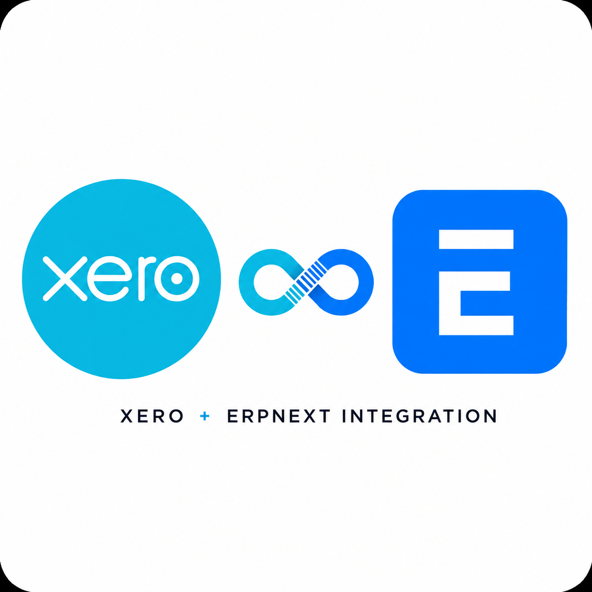

<div align="center">



# Xero Integration for ERPNext

**Bidirectional accounting sync between ERPNext and Xero**

[](https://github.com/EPIUSECX/cohenix_bma_xero/releases)
[](https://github.com/EPIUSECX/cohenix_bma_xero/actions/workflows/ci.yml)
[](#testing)
[](#known-limitations-beta)
[](license.txt)
[](https://frappeframework.com)

</div>

Bidirectional accounting sync between ERPNext and Xero: invoices, bills, payments,
journals, contacts, items, chart of accounts, credit notes, quotations, purchase
orders, and bank transactions — with OAuth2, webhooks, background queuing, and a
full monitoring dashboard.

**Status: Beta.**

> [!CAUTION]
> **This app reads from and writes to your accounting records in both systems.**
> Never connect it to a live Xero organisation or a production ERPNext site until
> you have completed the staged rollout below. A misconfigured or failed sync run
> against live data can overwrite or destroy real accounting records in Xero,
> ERPNext, or both. Follow **[Safe Rollout](#safe-rollout--read-before-connecting)**
> and read the **[Disclaimer](#disclaimer-of-warranty--liability)** before use.

## Features

**ERPNext → Xero (outbound)**
- Sales Invoices → Invoices, Purchase Invoices → Bills (line items, taxes, rounding)
- Payment Entries → Payments, Journal Entries → Manual Journals
- Customers / Suppliers → Contacts (addresses, contact persons)
- Items, Chart of Accounts, Credit Notes, Quotations → Quotes, Purchase Orders
- Bank transactions are *deliberately not pushed* — bank movement reaches Xero via
  Payment and Manual Journal sync to avoid double-counting.

**Xero → ERPNext (inbound)**
- Chart of Accounts, Contacts (and contact notes), Items, Invoices, Bills,
  Credit Notes, Payments, Bank Transactions

**Operations**
- Sync dashboard: health overview, manual/bulk sync triggers, per-entity status,
  searchable sync logs with retry, analytics, and configuration tools
- Background processing via the Frappe queue with rate limiting (Xero allows
  60 calls/min; the app self-throttles below that), exponential-backoff retries,
  and idempotency keys on creates
- Webhooks for near-real-time inbound updates where Xero emits them (currently
  Invoices and Contacts); scheduled polling covers everything else
- Loop prevention: content hashing and hook suppression stop echo syncs
- Full audit trail in the **Xero Log** doctype

## Requirements

- Frappe Framework **v16** and ERPNext **v16** (`frappe>=16.0.0,<17.0.0`)
- Python **3.14** — Frappe v16 pins `>=3.14,<3.15` and uses PEP 695 syntax, so
  earlier interpreters cannot build it
- A Xero account plus a [Xero developer app](https://developer.xero.com/) (OAuth2 web app)
- Access to a **non-live Xero organisation** (e.g. the Xero Demo Company) for testing

## Installation

```bash
cd /path/to/your/bench
bench get-app https://github.com/EPIUSECX/cohenix_bma_xero.git
bench --site your-site install-app xero
bench --site your-site migrate
```

Custom fields on the ERPNext doctypes (sync IDs, status, hashes) are installed
automatically on install and on every migrate — no manual step.

After installing, run the offline test suite to confirm the environment is sound
(no Xero connection required):

```bash
bench --site your-site run-tests --app xero
```

## Connecting to Xero

1. In the [Xero Developer Console](https://developer.xero.com/), create a
   **Web App** and note the Client ID and Client Secret.
2. Set the OAuth redirect URI to:
   `https://<your-erpnext-host>/api/method/xero.utils.xero_client.handle_oauth_callback`
3. In ERPNext, open **Xero Settings**, enter the Client ID and Secret, and click
   **Authorize with Xero**. Sign in and select the organisation (tenant).

The app requests granular accounting scopes (invoices, payments, bank
transactions, manual journals, contacts, settings, and read-only report scopes)
plus `offline_access` for token refresh. Tokens are stored encrypted and refresh
automatically; System Managers are emailed if refresh fails.

> [!IMPORTANT]
> During testing, authorize against the **Xero Demo Company** (or another
> organisation containing no real data) — never your trading organisation.

### Webhooks (optional)

To receive near-real-time inbound updates, configure a webhook in the Xero
Developer Console pointing to
`https://<your-erpnext-host>/api/method/xero.utils.webhook_handler.handle_webhook`,
copy the webhook key into Xero Settings, and tick **Enable Webhooks**. Payloads
are HMAC-verified and de-duplicated.

## Configuration

All configuration lives in **Xero Settings** (single doctype):

- **Enable Xero Synchronization** — master switch. Nothing syncs while this is off.
- **Enable Sync TO Xero (ERPNext → Xero)** — outbound master switch, with
  per-entity checkboxes (contacts, items, invoices, bills, credit notes,
  payments, journal entries, purchase orders, quotations).
- **Enable Sync FROM Xero (Xero → ERPNext)** — inbound master switch, with
  per-entity checkboxes (contacts, contact notes, items, invoices, bills,
  credit notes, payments, chart of accounts).
- **Automatic Synchronization** — scheduled/auto sync, webhooks, rate-limit
  tracking, incremental (changed-records-only) sync.

Before enabling any invoice or payment sync, set up:

- **Account mappings** (Xero Account Mapping) — map ERPNext accounts to Xero
  account codes. Pull the Xero chart first:
  `bench --site your-site execute xero.api.xero_accounts.sync_accounts_from_xero`
- **Tax mappings** (Xero Tax Mapping) — map ERPNext tax templates/accounts to
  Xero tax types. Unmapped taxes cause sync failures, visible in the Xero Log.

Sync operations require the **System Manager** or **Xero Integration Manager** role.

## Safe Rollout — Read Before Connecting

> [!WARNING]
> Do not skip stages. Each stage exists because the next one is harder to undo.
> **Take a fresh ERPNext backup (`bench --site your-site backup`) and export your
> Xero data before every stage change.**

### Stage 1 — Non-live everything (mandatory first step)

Connect a **test ERPNext site** to a **non-live Xero organisation** (the
[Xero Demo Company](https://central.xero.com/s/article/Use-the-demo-company) is
free and resets itself). Exercise the full workflow you intend to use: contacts,
items, invoices both directions, payments, credit notes. Verify account and tax
mappings produce correct, reconciling figures in both systems. Stay here until
you have run at least one complete accounting cycle without unexplained errors
in the Xero Log.

### Stage 2 — Inbound only against your real data

When Stage 1 is clean, connect your production ERPNext site to your live Xero
organisation with **outbound sync disabled**:

- Tick **Enable Sync FROM Xero**; leave **Enable Sync TO Xero unticked**.
- Enable inbound entities gradually — chart of accounts and contacts first,
  transactional documents after you have reviewed the masters.

Inbound-only mode never writes to Xero, but it **does create and update
documents in ERPNext** — review imported records, mappings, currencies, and tax
figures carefully, and keep backups current.

### Stage 3 — Full bidirectional

Only after inbound data has proven correct, enable **Enable Sync TO Xero** and
switch on outbound entities incrementally: masters first (contacts, items,
accounts), then invoices/bills, then payments. Watch the dashboard and Xero Log
closely after each step. Failed documents are marked and re-queued or, when Xero
permanently rejects them, marked **Failed** for explicit operator retry.

## The Sync Dashboard

Open **Xero Sync Dashboard** from the desk. Tabs: **Overview** (connection and
health), **Sync Operations** (manual per-entity and bulk triggers, retry failed,
clear old logs), **Analytics** (success rates, throughput, error trends),
**Entity Status** (per-doctype counts and last-sync times), **Sync Logs**
(filterable audit trail with per-row retry), and **Configuration** (token status,
mapping shortcuts, diagnostics).

## How Syncing Runs

- **Document events** — submitting a Sales/Purchase Invoice, Payment Entry,
  Journal Entry, Quotation, or Purchase Order (or updating a Customer, Supplier,
  Item, or Account) enqueues an outbound sync in the background. Cancelling an
  invoice voids it in Xero; cancelling a journal deletes the manual journal.
- **Scheduled jobs** — hourly: pending-document sync, payment status checks,
  health monitoring, contact notes; daily: full sync of enabled entities and
  integrity validation; weekly: reconciliation and log cleanup.
- **Webhooks** — inbound Invoice/Contact changes are processed as they arrive
  when webhooks are enabled.

## Troubleshooting

| Symptom | What to do |
| --- | --- |
| "Unauthorized" / token errors | Xero Settings → **Authorize with Xero** again; or force a refresh: `bench --site your-site execute xero.utils.xero_client.refresh_access_token` |
| Documents stuck Pending/Error | Dashboard → Sync Logs: the log row carries Xero's actual validation message. Fix the cause (usually a missing account/tax mapping), then Retry. |
| Documents marked **Failed** | Xero permanently rejected the payload (validation). Failed docs are *not* auto-retried — fix the data or mapping, then retry explicitly from the dashboard. |
| Rate-limit warnings | The app throttles itself and honors Xero's `Retry-After`; persistent 429s mean another app shares the tenant's limit. Reduce batch sizes or sync frequency. |
| Archived Xero contact won't update | Xero's API rejects all writes to archived contacts. Un-archive in the Xero web UI first. |

Every failure is recorded in the **Xero Log** with the document link, direction,
and Xero's error detail.

## Known Limitations (Beta)

- Multi-currency edge cases are not fully covered — verify FX documents in
  Stage 1 before relying on them.
- Xero emits webhooks only for Invoices and Contacts; other entities sync on
  schedule or manually.
- Outbound Bank Transaction push is disabled by design (see Features).
- One Xero organisation (tenant) per ERPNext site is the tested configuration.

## Testing

**119 tests across 8 modules, all passing** (4 skipped), verified on Frappe and
ERPNext v16:

| Module | Tests | Covers |
| --- | ---: | --- |
| `test_xero_client` | 23 | OAuth token refresh and rotation, webhook HMAC verification, retry/backoff, idempotency keys |
| `test_inbound_behavior` | 21 | Account-type mapping and inbound auto-submit guards |
| `test_invoice_sync` | 17 | Outbound invoice validation and change-detection hashing |
| `test_contact_sync` | 14 | Customer ↔ Xero Contact round trip, loop-prevention guards |
| `test_manual_sync` | 12 | Operator-triggered sync paths |
| `test_sync_status` | 12 | Sync state tracking and dashboard status |
| `test_account_mapper` | 11 | Chart-of-accounts mapping rules |
| `test_pending_retry` | 9 | Queued retry handling |

The shipped suite is fully offline — every test mocks the Xero HTTP layer and
rolls back its writes, so it is safe on any site:

```bash
bench --site your-site run-tests --app xero                                    # full suite
bench --site your-site run-tests --app xero --module xero.tests.test_contact_sync
```

Coverage: OAuth token refresh/rotation and failure paths, webhook HMAC
verification, retry/backoff and idempotency keys (`test_xero_client`); a full
Customer ↔ Xero Contact round trip including loop-prevention guards
(`test_contact_sync`); outbound invoice validation and change-detection hashing
(`test_invoice_sync`); account-type mapping and inbound auto-submit guards
(`test_inbound_behavior`).

## Support

- **Issues & feature requests:** [GitHub Issues](https://github.com/EPIUSECX/cohenix_bma_xero/issues)
- **Email:** support@epiuse.com

## Disclaimer of Warranty & Liability

This software is provided **"as is"**, without warranty of any kind. It is
**Beta software** that reads and writes financial records; used incorrectly —
in particular, tested against a live Xero organisation or production ERPNext
site contrary to the Safe Rollout guidance above — it can overwrite, corrupt,
or destroy real accounting data.

To the maximum extent permitted by law, the authors, copyright holders, and
publishers **accept no liability for any loss or damage whatsoever** (including
loss of data, loss of profits, business interruption, accounting or tax
consequences, or the cost of data reconstruction) arising from the use of, or
inability to use, this software — including losses caused by a failed or
misconfigured test or sync run against live data. **You are responsible for
testing on non-live systems and maintaining backups of both systems.**

The full text, including your responsibilities and trademark notices, is in
[DISCLAIMER.md](DISCLAIMER.md). This app is not affiliated with, endorsed by, or
supported by Xero Limited.

## License

MIT — see [license.txt](license.txt).
