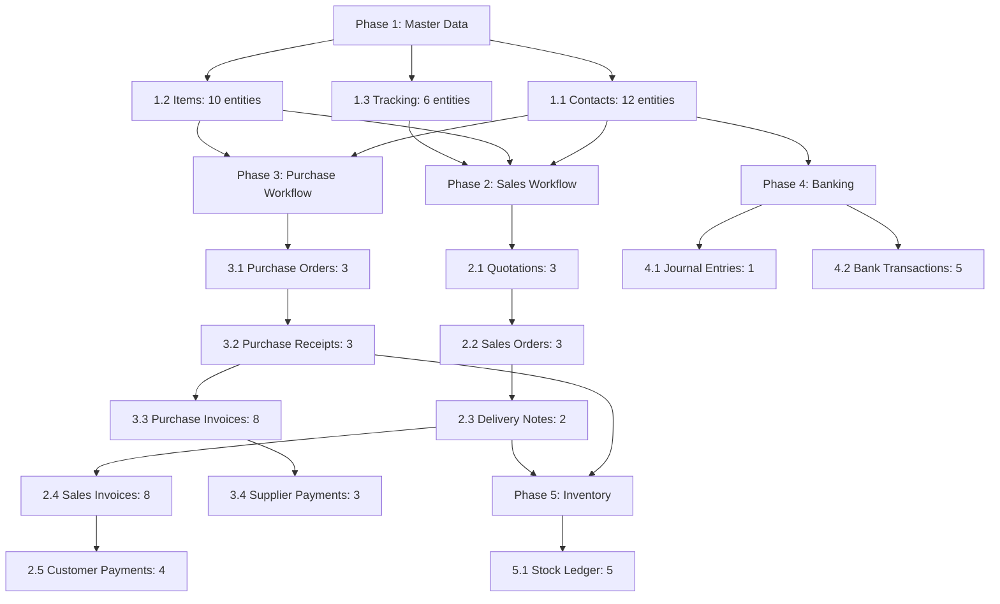

# Comprehensive ERPNext → Xero Sync Plan

**Date:** 2025-12-08  
**Purpose:** Plan one-directional sync of all test data from ERPNext to Xero  
**Scope:** 133 entities across 17 entity types  
**Approach:** Systematic, dependency-aware sync with comprehensive logging

---

## 🎯 Sync Objectives

1. **Validate Integration:** Test Xero sync functionality for all entity types
2. **Identify Issues:** Document any sync failures or errors
3. **Verify Mappings:** Confirm account and tax mappings work correctly
4. **Test Workflows:** Validate complete business workflow sync
5. **Generate Metrics:** Collect sync performance data

---

## 📋 Sync Strategy

### Principle: Dependency-First Approach

Sync entities in order of dependencies to ensure:
- Master data exists before transactional data
- Parent documents exist before child documents
- Referenced entities are synced before referencing entities

---

## 🔄 Sync Execution Order

### Phase 1: Master Data (Foundation)
**Priority:** CRITICAL - Must sync first  
**Entities:** 26 total

#### 1.1 Contacts (Customers & Suppliers)
**Order:** Sync first (no dependencies)

```bash
# Sync all customers
bench --site cohenix.localhost execute "
from xero.api.xero_contacts import sync_contact_to_xero
customers = frappe.get_all('Customer', fields=['name'])
for c in customers:
    try:
        sync_contact_to_xero(c.name, 'Customer')
        print(f'✓ Synced Customer: {c.name}')
    except Exception as e:
        print(f'✗ Failed Customer {c.name}: {str(e)}')
"

# Sync all suppliers
bench --site cohenix.localhost execute "
from xero.api.xero_contacts import sync_contact_to_xero
suppliers = frappe.get_all('Supplier', fields=['name'])
for s in suppliers:
    try:
        sync_contact_to_xero(s.name, 'Supplier')
        print(f'✓ Synced Supplier: {s.name}')
    except Exception as e:
        print(f'✗ Failed Supplier {s.name}: {str(e)}')
"
```

**Expected Results:**
- 7 Customers synced to Xero Contacts
- 5 Suppliers synced to Xero Contacts
- Total: 12 Contact entities in Xero

**Potential Issues:**
- Missing contact information (email, phone)
- Address validation errors
- Duplicate contact detection

---

#### 1.2 Items
**Order:** After Contacts (no dependencies, but good practice)

```bash
# Sync all items
bench --site cohenix.localhost execute "
from xero.api.xero_items import sync_item_to_xero
items = frappe.get_all('Item', fields=['item_code'])
for item in items:
    try:
        sync_item_to_xero(item.item_code)
        print(f'✓ Synced Item: {item.item_code}')
    except Exception as e:
        print(f'✗ Failed Item {item.item_code}: {str(e)}')
"
```

**Expected Results:**
- 10 Items synced to Xero
- Sales/Purchase/Stock items all synced

**Potential Issues:**
- Account code mapping errors
- Tax rate mapping issues
- Item code validation

---

#### 1.3 Tracking Categories (Cost Centers & Projects)
**Order:** After Contacts (Projects may reference Customers)

```bash
# Sync cost centers
bench --site cohenix.localhost execute "
from xero.api.xero_tracking_categories import sync_cost_center_to_xero
cost_centers = frappe.get_all('Cost Center', 
    filters={'company': 'EPIUSE', 'is_group': 0},
    fields=['name'])
for cc in cost_centers:
    try:
        sync_cost_center_to_xero(cc.name)
        print(f'✓ Synced Cost Center: {cc.name}')
    except Exception as e:
        print(f'✗ Failed Cost Center {cc.name}: {str(e)}')
"

# Sync projects
bench --site cohenix.localhost execute "
from xero.api.xero_projects import sync_project_to_xero
projects = frappe.get_all('Project',
    filters={'company': 'EPIUSE'},
    fields=['name'])
for proj in projects:
    try:
        sync_project_to_xero(proj.name)
        print(f'✓ Synced Project: {proj.name}')
    except Exception as e:
        print(f'✗ Failed Project {proj.name}: {str(e)}')
"
```

**Expected Results:**
- 4 Cost Centers synced as Tracking Categories
- 2 Projects synced as Tracking Categories
- Total: 6 Tracking Category Options

**Potential Issues:**
- Tracking category creation limits
- Duplicate tracking option names
- Customer reference validation

---

### Phase 2: Sales Workflow
**Priority:** HIGH - Core business workflow  
**Dependencies:** Customers, Items  
**Entities:** 22 total

#### 2.1 Quotations
**Order:** First in sales workflow

```bash
# Sync all quotations
bench --site cohenix.localhost execute "
from xero.api.xero_quotes import sync_quotation_to_xero
quotations = frappe.get_all('Quotation',
    filters={'company': 'EPIUSE', 'docstatus': ['in', [0, 1]]},
    fields=['name'])
for quot in quotations:
    try:
        sync_quotation_to_xero(quot.name)
        print(f'✓ Synced Quotation: {quot.name}')
    except Exception as e:
        print(f'✗ Failed Quotation {quot.name}: {str(e)}')
"
```

**Expected Results:**
- 3 Quotations synced to Xero Quotes

**Potential Issues:**
- Draft vs Submitted status handling
- Line item validation
- Customer reference errors

---

#### 2.2 Sales Orders
**Order:** After Quotations

```bash
# Sync all sales orders
bench --site cohenix.localhost execute "
from xero.api.xero_sales_orders import sync_sales_order_to_xero
sales_orders = frappe.get_all('Sales Order',
    filters={'company': 'EPIUSE', 'docstatus': 1},
    fields=['name'])
for so in sales_orders:
    try:
        sync_sales_order_to_xero(so.name)
        print(f'✓ Synced Sales Order: {so.name}')
    except Exception as e:
        print(f'✗ Failed Sales Order {so.name}: {str(e)}')
"
```

**Expected Results:**
- 3 Submitted Sales Orders synced

**Potential Issues:**
- Only submitted orders should sync
- Item availability validation
- Delivery date requirements

---

#### 2.3 Delivery Notes
**Order:** After Sales Orders

```bash
# Sync all delivery notes
bench --site cohenix.localhost execute "
from xero.api.xero_delivery_notes import sync_delivery_note_to_xero
delivery_notes = frappe.get_all('Delivery Note',
    filters={'company': 'EPIUSE', 'docstatus': ['in', [0, 1]]},
    fields=['name'])
for dn in delivery_notes:
    try:
        sync_delivery_note_to_xero(dn.name)
        print(f'✓ Synced Delivery Note: {dn.name}')
    except Exception as e:
        print(f'✗ Failed Delivery Note {dn.name}: {str(e)}')
"
```

**Expected Results:**
- 2 Delivery Notes synced

**Potential Issues:**
- Stock item validation
- Warehouse mapping
- Sales Order reference

---

#### 2.4 Sales Invoices
**Order:** After Delivery Notes

```bash
# Sync all sales invoices (including credit notes)
bench --site cohenix.localhost execute "
from xero.api.xero_invoices import sync_invoice_to_xero
sales_invoices = frappe.get_all('Sales Invoice',
    filters={'company': 'EPIUSE', 'docstatus': 1},
    fields=['name', 'is_return'])
for si in sales_invoices:
    try:
        sync_invoice_to_xero(si.name, 'Sales Invoice')
        doc_type = 'Credit Note' if si.is_return else 'Invoice'
        print(f'✓ Synced {doc_type}: {si.name}')
    except Exception as e:
        print(f'✗ Failed Sales Invoice {si.name}: {str(e)}')
"
```

**Expected Results:**
- 5 Sales Invoices synced to Xero Invoices
- 3 Credit Notes synced to Xero Credit Notes
- Total: 8 documents

**Potential Issues:**
- Account mapping errors
- Tax calculation differences
- Line item validation
- Credit note reference validation

---

#### 2.5 Customer Payments
**Order:** After Sales Invoices

```bash
# Sync customer payment entries
bench --site cohenix.localhost execute "
from xero.api.xero_payments import sync_payment_to_xero
payments = frappe.get_all('Payment Entry',
    filters={'company': 'EPIUSE', 'party_type': 'Customer', 'docstatus': ['in', [0, 1]]},
    fields=['name'])
for pe in payments:
    try:
        sync_payment_to_xero(pe.name)
        print(f'✓ Synced Payment: {pe.name}')
    except Exception as e:
        print(f'✗ Failed Payment {pe.name}: {str(e)}')
"
```

**Expected Results:**
- 4 Customer Payments synced (3 with invoice refs + 1 advance)

**Potential Issues:**
- Invoice reference validation
- Payment allocation errors
- Bank account mapping

---

### Phase 3: Purchase Workflow
**Priority:** HIGH - Core business workflow  
**Dependencies:** Suppliers, Items  
**Entities:** 22 total

#### 3.1 Purchase Orders
**Order:** First in purchase workflow

```bash
# Sync all purchase orders
bench --site cohenix.localhost execute "
from xero.api.xero_purchase_orders import sync_purchase_order_to_xero
purchase_orders = frappe.get_all('Purchase Order',
    filters={'company': 'EPIUSE', 'docstatus': 1},
    fields=['name'])
for po in purchase_orders:
    try:
        sync_purchase_order_to_xero(po.name)
        print(f'✓ Synced Purchase Order: {po.name}')
    except Exception as e:
        print(f'✗ Failed Purchase Order {po.name}: {str(e)}')
"
```

**Expected Results:**
- 3 Submitted Purchase Orders synced

---

#### 3.2 Purchase Receipts
**Order:** After Purchase Orders

```bash
# Sync all purchase receipts
bench --site cohenix.localhost execute "
from xero.api.xero_purchase_receipts import sync_purchase_receipt_to_xero
purchase_receipts = frappe.get_all('Purchase Receipt',
    filters={'company': 'EPIUSE', 'docstatus': 1},
    fields=['name'])
for pr in purchase_receipts:
    try:
        sync_purchase_receipt_to_xero(pr.name)
        print(f'✓ Synced Purchase Receipt: {pr.name}')
    except Exception as e:
        print(f'✗ Failed Purchase Receipt {pr.name}: {str(e)}')
"
```

**Expected Results:**
- 3 Purchase Receipts synced

---

#### 3.3 Purchase Invoices
**Order:** After Purchase Receipts

```bash
# Sync all purchase invoices (including debit notes)
bench --site cohenix.localhost execute "
from xero.api.xero_invoices import sync_invoice_to_xero
purchase_invoices = frappe.get_all('Purchase Invoice',
    filters={'company': 'EPIUSE', 'docstatus': 1},
    fields=['name', 'is_return'])
for pi in purchase_invoices:
    try:
        sync_invoice_to_xero(pi.name, 'Purchase Invoice')
        doc_type = 'Debit Note' if pi.is_return else 'Bill'
        print(f'✓ Synced {doc_type}: {pi.name}')
    except Exception as e:
        print(f'✗ Failed Purchase Invoice {pi.name}: {str(e)}')
"
```

**Expected Results:**
- 5 Purchase Invoices synced to Xero Bills
- 3 Debit Notes synced to Xero Credit Notes
- Total: 8 documents

---

#### 3.4 Supplier Payments
**Order:** After Purchase Invoices

```bash
# Sync supplier payment entries
bench --site cohenix.localhost execute "
from xero.api.xero_payments import sync_payment_to_xero
payments = frappe.get_all('Payment Entry',
    filters={'company': 'EPIUSE', 'party_type': 'Supplier', 'docstatus': ['in', [0, 1]]},
    fields=['name'])
for pe in payments:
    try:
        sync_payment_to_xero(pe.name)
        print(f'✓ Synced Payment: {pe.name}')
    except Exception as e:
        print(f'✗ Failed Payment {pe.name}: {str(e)}')
"
```

**Expected Results:**
- 3 Supplier Payments synced

---

### Phase 4: Banking & Accounting
**Priority:** MEDIUM - Financial management  
**Dependencies:** Contacts, Accounts  
**Entities:** 11 total

#### 4.1 Journal Entries
**Order:** Independent (can sync anytime after accounts)

```bash
# Sync all journal entries
bench --site cohenix.localhost execute "
from xero.api.xero_journals import sync_journal_to_xero
journals = frappe.get_all('Journal Entry',
    filters={'company': 'EPIUSE', 'docstatus': 1},
    fields=['name'])
for je in journals:
    try:
        sync_journal_to_xero(je.name)
        print(f'✓ Synced Journal Entry: {je.name}')
    except Exception as e:
        print(f'✗ Failed Journal Entry {je.name}: {str(e)}')
"
```

**Expected Results:**
- 1 Journal Entry synced to Xero Manual Journal

**Potential Issues:**
- Account mapping validation
- Balanced entry requirements
- Narration/description formatting

---

#### 4.2 Bank Transactions
**Order:** Independent

```bash
# Sync all bank transactions
bench --site cohenix.localhost execute "
from xero.api.xero_bank_transactions import sync_bank_transaction_to_xero
bank_txns = frappe.get_all('Bank Transaction',
    filters={'company': 'EPIUSE', 'docstatus': ['in', [0, 1]]},
    fields=['name'])
for bt in bank_txns:
    try:
        sync_bank_transaction_to_xero(bt.name)
        print(f'✓ Synced Bank Transaction: {bt.name}')
    except Exception as e:
        print(f'✗ Failed Bank Transaction {bt.name}: {str(e)}')
"
```

**Expected Results:**
- 5 Bank Transactions synced

**Potential Issues:**
- Bank account mapping
- Transaction type validation
- Party reference handling

---

### Phase 5: Inventory (Optional)
**Priority:** LOW - Auto-generated  
**Dependencies:** Items, Warehouses  
**Entities:** 5 total

#### 5.1 Stock Ledger Entries
**Order:** Last (auto-generated from other documents)

```bash
# Sync stock ledger entries (if supported)
bench --site cohenix.localhost execute "
from xero.api.xero_stock import sync_stock_ledger_to_xero
stock_entries = frappe.get_all('Stock Ledger Entry',
    filters={'company': 'EPIUSE'},
    fields=['name'],
    limit=10)
for sle in stock_entries:
    try:
        sync_stock_ledger_to_xero(sle.name)
        print(f'✓ Synced Stock Ledger: {sle.name}')
    except Exception as e:
        print(f'✗ Failed Stock Ledger {sle.name}: {str(e)}')
"
```

**Expected Results:**
- 5 Stock Ledger Entries synced (if API supports)

**Note:** Stock Ledger Entry sync may not be implemented in Xero API

---

## 📊 Sync Execution Plan

### Recommended Execution Sequence:



---

## 📝 Logging Strategy

### Create Sync Log Document: `XERO_SYNC_TEST_RESULTS.md`

**Log Structure:**
```markdown
# Xero Sync Test Results

## Execution Date: [DATE]

### Phase 1: Master Data
#### 1.1 Contacts
- ✅/✗ Customer Name: [Success/Error message]
- ...

#### 1.2 Items
- ✅/✗ Item Code: [Success/Error message]
- ...

[Continue for all phases]

## Summary Statistics
- Total Attempted: X
- Successful: Y
- Failed: Z
- Success Rate: Y/X %

## Issues Encountered
1. [Issue description]
   - Entity: [Name]
   - Error: [Error message]
   - Potential Fix: [Suggestion]
```

---

## 🔍 Validation Checks

### Pre-Sync Validation:
```bash
# Check Xero connection
bench --site cohenix.localhost execute "
from xero.utils.xero_client import get_xero_settings, test_xero_connection
settings = get_xero_settings()
print(f'Xero Sync Enabled: {settings.enable_xero_sync}')
print(f'Connection Test: {test_xero_connection()}')
"

# Check sync settings
bench --site cohenix.localhost execute "
from xero.utils.xero_client import get_xero_settings
settings = get_xero_settings()
print(f'Sync Contacts: {settings.sync_contacts}')
print(f'Sync Items: {settings.sync_items}')
print(f'Sync Invoices: {settings.sync_invoices}')
print(f'Sync Payments: {settings.sync_payments}')
"
```

### Post-Sync Validation:
```bash
# Check sync status for each entity type
bench --site cohenix.localhost execute "
entity_types = [
    'Customer',
    'Supplier',
    'Item',
    'Sales Invoice',
    'Purchase Invoice',
    'Payment Entry',
    'Journal Entry',
    'Quotation',
    'Bank Transaction',
    'Sales Order',
    'Purchase Order',
    'Delivery Note',
    'Purchase Receipt'
]

for doctype in entity_types:
    synced = frappe.db.count(doctype, {'xero_sync_status': 'Synced'})
    error = frappe.db.count(doctype, {'xero_sync_status': 'Error'})
    pending = frappe.db.count(doctype, {'xero_sync_status': 'Pending'})
    print(f'{doctype}: Synced={synced}, Error={error}, Pending={pending}')
"
```

---

## ⚠️ Known Considerations

### Entity-Specific Notes:

1. **Customers/Suppliers:**
   - May need email addresses for Xero
   - Address formatting may differ
   - Contact person details optional

2. **Items:**
   - Account code mappings must exist
   - Tax rates must be configured
   - Sales/Purchase details required

3. **Invoices:**
   - Must be submitted (docstatus=1) for sync
   - Line items must reference synced items
   - Account mappings critical

4. **Payments:**
   - Invoice references must be synced first
   - Bank account mapping required
   - Allocation amounts must match

5. **Journal Entries:**
   - Must be balanced (debit = credit)
   - Account mappings required
   - Must be submitted

6. **Bank Transactions:**
   - Bank Account doctype must exist
   - Party references optional
   - Deposit/Withdrawal must be set

7. **Quotations:**
   - Can sync in Draft or Submitted status
   - Customer must be synced first
   - Items must be synced first

8. **Orders:**
   - Should be submitted for sync
   - Delivery/receipt status tracked
   - Item availability not validated

9. **Delivery/Receipt Notes:**
   - Stock items required
   - Warehouse configuration needed
   - Order references validated

10. **Stock Ledger:**
    - Auto-generated from stock transactions
    - May not have direct Xero sync
    - Tracked for audit purposes

---

## 📈 Success Metrics

### Target Metrics:
- **Sync Success Rate:** >90%
- **Master Data Sync:** 100% (critical)
- **Transaction Sync:** >85%
- **Error Resolution:** Document all issues

### Key Performance Indicators:
- Contacts synced: 12/12 (100%)
- Items synced: 10/10 (100%)
- Invoices synced: >14/16 (>87%)
- Payments synced: >5/7 (>71%)
- Overall sync rate: >80%

---

## 🛠️ Error Handling

### For Each Sync Failure:
1. **Log the Error:** Capture full error message
2. **Identify Root Cause:** Account mapping, validation, API issue
3. **Document Workaround:** If applicable
4. **Note for Future:** Add to known issues list

### Common Error Categories:
- **Mapping Errors:** Account codes, tax rates not configured
- **Validation Errors:** Missing required fields, invalid data
- **Connection Errors:** API timeout, authentication issues
- **Rate Limiting:** Too many requests
- **Reference Errors:** Referenced entity not synced

---

## 📋 Execution Checklist

### Pre-Execution:
- [ ] Verify Xero API connection
- [ ] Check Xero Settings configuration
- [ ] Confirm account mappings exist
- [ ] Verify tax rate mappings
- [ ] Check sync enable flags

### During Execution:
- [ ] Execute phases in dependency order
- [ ] Log all results (success and failure)
- [ ] Monitor Xero Log doctype
- [ ] Check API rate limits
- [ ] Verify sync status updates

### Post-Execution:
- [ ] Count synced entities by type
- [ ] Calculate success rates
- [ ] Document all errors
- [ ] Create summary report
- [ ] Identify improvement areas

---

## 📄 Deliverables

### 1. Sync Execution Log
**File:** `XERO_SYNC_TEST_RESULTS.md`
- Complete sync attempt log
- Success/failure for each entity
- Error messages captured
- Timestamps recorded

### 2. Issue Summary
**File:** `XERO_SYNC_ISSUES_LOG.md`
- All errors categorized
- Root cause analysis
- Suggested fixes
- Priority ranking

### 3. Success Metrics
**File:** `XERO_SYNC_METRICS.md`
- Sync success rates by entity type
- Overall coverage achieved
- Performance statistics
- Comparison with targets

---

## 🎯 Expected Outcomes

### Best Case Scenario:
- 90%+ sync success rate
- All master data synced
- Most transactions synced
- Clear error documentation for failures

### Realistic Scenario:
- 80%+ sync success rate
- All master data synced
- Some transaction sync issues
- Account mapping gaps identified

### Worst Case Scenario:
- 60%+ sync success rate
- Master data mostly synced
- Transaction sync challenges
- Configuration issues identified

**In all cases:** Comprehensive documentation of results and issues for improvement

---

## 🚀 Ready to Execute

All prerequisites met:
- ✅ 133 entities created
- ✅ All entity types covered
- ✅ Xero custom fields configured
- ✅ Sync functions available
- ✅ Logging strategy defined

**Next Step:** Execute sync plan and document results in `XERO_SYNC_TEST_RESULTS.md`

---

**Plan Created:** 2025-12-08  
**Total Entities to Sync:** 133  
**Entity Types:** 17  
**Estimated Time:** 2-3 hours  
**Status:** ✅ Ready for Execution
